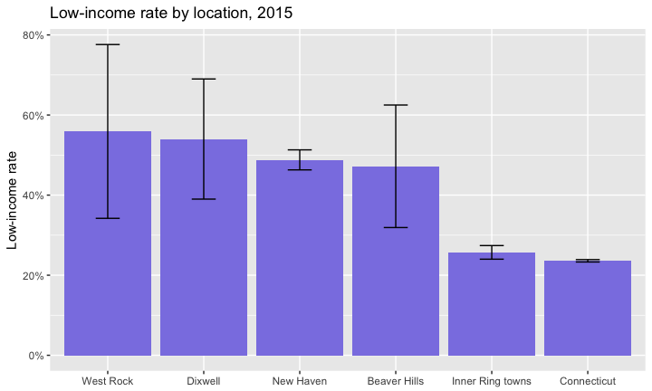

# Making Local ACS Profiles in R
Camille Seaberry, DataHaven  
July 4, 2017  


## Introducing `acs.R`

* `acs.R` package provides easier interface for working with Census API
* Focused on ACS, but also can access SF1, SF3 decennial tables
* Comes with its own weird objects---something to get used to
* Developed by Ezra Habel Glenn at MIT
* Very good user guide! http://bit.ly/acshandbook

See the repo for this presentation at https://github.com/CT-Data-Haven/acs_presentation


## Goal & what we're working on

**Goal:** make a profile of several indicators for local geographies in R

**Input:** the `acs.R` package & API key from the Census

**Output:** CSV file ready to share with clients, public, etc


## The plan

* Make combined geographies
* Pull several ACS tables using the `acs` package
* Aggregate variables as needed
* Calculate stuff---rates, etc
* Get everything into a single dataframe & write to csv


```r
library(acs)
```


## #TeamTidyverse

* Making heavy use of the tidyverse packages
* `purrr` lets us use `map` functions to work with lists
* Learn more: 
    + http://tidyverse.org/
    + http://r4ds.had.co.nz/


```r
library(tidyverse)
library(stringr)
```

There's a very new (May 2017) package called `tidycensus` that I haven't worked with yet, but recommend people also check out: https://github.com/walkerke/tidycensus

## Making ACS geographies

* `acs` package has several of its own object types, including `geo.set` for geographies
* Make `geo.set` objects based on FIPS codes, names
* Can combine multiple geographies in a few ways:
    + as a list of geographies (`combine` = `FALSE`)
    + a merged geography (`combine` = `TRUE`)
  
  
## Local geographies

See documentation on `geo.make` to see lots of different ways to make geographies, given FIPS codes and names. Ones I use commonly involve:

Single state


```r
ct <- geo.make(state = 09)
```

Single town


```r
nhv <- geo.make(state = 09, county = 09, county.subdivision = "New Haven")
```

Multiple towns merged into single geography with `combine = T`


```r
inner_ring <- geo.make(state = 09, county = 09, 
                       county.subdivision = c("Hamden", "West Haven", "East Haven"), 
                       combine = T, combine.term = "Inner Ring towns")
```


## Local geographies con't

Neighborhoods get a little more tricky

Single Census tract


```r
dixwell <- geo.make(state = 09, county = 09, tract = 141600)
```

Single tract, multiple block groups merged


```r
west_rock <- geo.make(state = 09, county = 09, 
                      tract = 141300, block.group = c(1, 4), 
                      combine = T, combine.term = "West Rock")
```

Mashup of block groups from multiple tracts (using wildcard `"*"`)


```r
beaver_hills <- geo.make(state = 09, county = 09, 
                         tract = c(141400, 141300), block.group = c("*", 2), 
                         combine = T, combine.term = "Beaver Hills")
```

Then make `geo.set` using `c`


```r
geos <- c(ct, nhv, inner_ring, beaver_hills, dixwell, west_rock)
```


## Pulling an ACS table

Easiest way to find table numbers is on FactFinder :(

Total population: B01003

`acs.fetch` gets an ACS table for a geography & year---yields an `acs` object


```r
pop <- acs.fetch(geography = geos, endyear = 2015, 
                 table.number = "B01003", col.names = "pretty")
pop
```

```
## ACS DATA: 
##  2011 -- 2015 ;
##   Estimates w/90% confidence intervals;
##   for different intervals, see confint()
##                                                  Total Population: Total    
## Connecticut                                      3593222 +/- 0              
## New Haven town, New Haven County, Connecticut    130612 +/- 50              
## Inner Ring towns                                 145816 +/- 96.4676111448812
## Beaver Hills                                     5521 +/- 805.957194893128  
## Census Tract 1416, New Haven County, Connecticut 4898 +/- 503               
## West Rock                                        4132 +/- 463.159799637231
```


## Pulling several ACS tables

Using `purrr` functions, map over a named list of table numbers---yields a named list of `acs` objects


```r
table_nums <- list( 
  total_pop = "B01003", 
  poverty = "C17002", 
  tenure = "B25003" 
)

fetch <- table_nums %>% 
  map(~acs.fetch(geography = geos, endyear = 2015, 
                 table.number = ., col.names = "pretty"))
```


## Analysis

`acs.R` has several functions for analysis, and allows many standard functions to work on `acs` objects---check the docs for `acs-class`

(I got tired of repeating some of these operations, and wrote an entire package to streamline this: https://github.com/CT-Data-Haven/acsprofiles)


```r
# use another list to hold tables
table <- vector("list", length = length(fetch)) %>% setNames(names(fetch))
```

### Total population

Total population is ready to go, but it helps to shorten the name


```r
table$total_pop <- fetch$total_pop[, 1]
acs.colnames(table$total_pop) <- "num_total_pop"
```


## Analysis con't

### Homeownership rate

Step by step:

* Get denominator: total households (column 1)
* Get number of owner-occupied households (column 2)
* Divide to get rate

Divide using `divide.acs` from `acs.R`


```r
households <- fetch$tenure[, 1]
owned <- fetch$tenure[, 2]
owned_rate <- divide.acs(owned, households)

table$tenure <- list(households, owned, owned_rate) %>% reduce(cbind)

# names come out ugly after division
acs.colnames(table$tenure) <- c("num_households", "num_owned_hh", "percent_owned_hh")
```


## Analysis con't

### Poverty & low-income rates

Step by step:

* Get denominator: total population for which poverty status is determined (column 1)
* Get population in poverty, i.e. below 1.0 x FPL (columns 2 + 3)
* Get low-income population, i.e. below 2.0 x FPL (columns 2 through 7)
* Divide to get rates


## Poverty & low-income con't

Add columns as necessary using `apply`, divide using `divide.acs` from `acs.R`


```r
deter <- fetch$poverty[, 1]
poverty <- apply(X = fetch$poverty[, 2:3], FUN = sum, MARGIN = 2, agg.term = "poverty")
pov_rate <- divide.acs(poverty, deter)

low_income <- apply(X = fetch$poverty[, 2:7], FUN = sum, MARGIN = 2, agg.term = "low inc")
low_inc_rate <- divide.acs(low_income, deter)

table$poverty <- list(deter, poverty, pov_rate, low_income, low_inc_rate) %>%
  reduce(cbind)

# names come out ugly after division
acs.colnames(table$poverty) <- c("num_poverty_determined", "num_in_poverty", 
                      "percent_poverty", "num_low_income", "percent_low_income")
```


## Finish with a dataframe

`acs` objects have several slots, including `@geography`, `@estimate`, `@standard.error`

A simple dataframe here will contain the name of the geography, then columns for all estimates. Using `@standard.error`, you can include margins of error calculations.


```r
all_tables <- table %>% reduce(cbind)

profile <- data.frame(name = all_tables@geography$NAME,
                      all_tables@estimate,
                      all_tables@standard.error * qnorm(0.95)) %>%
  tbl_df() %>%
  mutate(name = str_replace(name, " town,.+", "")) %>%
  mutate_at(vars(starts_with("percent")), funs(round(., digits = 3))) %>%
  mutate_at(vars(starts_with("num")), funs(round(.))) %>%
  setNames(str_replace(names(.), ".1", "_moe"))

# manually changing name for Dixwell---could use workaround if there were more to redo
profile$name[str_detect(profile$name, "Census Tract 1416")] <- "Dixwell"
```


## Our profile is ready!


```r
rmarkdown::paged_table(profile)
```

<div data-pagedtable="false">
  <script data-pagedtable-source type="application/json">
{"columns":[{"label":["name"],"name":[1],"type":["chr"],"align":["left"]},{"label":["num_total_pop"],"name":[2],"type":["dbl"],"align":["right"]},{"label":["num_poverty_determined"],"name":[3],"type":["dbl"],"align":["right"]},{"label":["num_in_poverty"],"name":[4],"type":["dbl"],"align":["right"]},{"label":["percent_poverty"],"name":[5],"type":["dbl"],"align":["right"]},{"label":["num_low_income"],"name":[6],"type":["dbl"],"align":["right"]},{"label":["percent_low_income"],"name":[7],"type":["dbl"],"align":["right"]},{"label":["num_households"],"name":[8],"type":["dbl"],"align":["right"]},{"label":["num_owned_hh"],"name":[9],"type":["dbl"],"align":["right"]},{"label":["percent_owned_hh"],"name":[10],"type":["dbl"],"align":["right"]},{"label":["num_total_pop_moe"],"name":[11],"type":["dbl"],"align":["right"]},{"label":["num_poverty_determined_moe"],"name":[12],"type":["dbl"],"align":["right"]},{"label":["num_in_poverty_moe"],"name":[13],"type":["dbl"],"align":["right"]},{"label":["percent_poverty_moe"],"name":[14],"type":["dbl"],"align":["right"]},{"label":["num_low_income_moe"],"name":[15],"type":["dbl"],"align":["right"]},{"label":["percent_low_income_moe"],"name":[16],"type":["dbl"],"align":["right"]},{"label":["num_households_moe"],"name":[17],"type":["dbl"],"align":["right"]},{"label":["num_owned_hh_moe"],"name":[18],"type":["dbl"],"align":["right"]},{"label":["percent_owned_hh_moe"],"name":[19],"type":["dbl"],"align":["right"]}],"data":[{"1":"Connecticut","2":"3593222","3":"3483303","4":"366351","5":"0.105","6":"822732","7":"0.236","8":"1352583","9":"906227","10":"0.670","11":"0","12":"824","13":"7025","14":"0.002","15":"10695","16":"0.003","17":"3661","18":"5290","19":"0.004"},{"1":"New Haven","2":"130612","3":"121961","4":"32480","5":"0.266","6":"59530","7":"0.488","8":"49771","9":"14374","10":"0.289","11":"50","12":"552","13":"2312","14":"0.019","15":"3006","16":"0.025","17":"926","18":"663","19":"0.014"},{"1":"Inner Ring towns","2":"145816","3":"137192","4":"15007","5":"0.109","6":"35310","7":"0.257","8":"54537","9":"34404","10":"0.631","11":"96","12":"599","13":"1508","14":"0.011","15":"2331","16":"0.017","17":"818","18":"781","19":"0.017"},{"1":"Beaver Hills","2":"5521","3":"5521","4":"1401","5":"0.254","6":"2608","7":"0.472","8":"2065","9":"906","10":"0.439","11":"806","12":"806","13":"574","14":"0.110","15":"755","16":"0.153","17":"240","18":"163","19":"0.094"},{"1":"Dixwell","2":"4898","3":"4099","4":"1344","5":"0.328","6":"2213","7":"0.540","8":"1832","9":"262","10":"0.143","11":"503","12":"498","13":"451","14":"0.117","15":"551","16":"0.150","17":"146","18":"101","19":"0.056"},{"1":"West Rock","2":"4132","3":"2066","4":"802","5":"0.388","6":"1154","7":"0.559","8":"843","9":"123","10":"0.146","11":"463","12":"449","13":"333","14":"0.182","15":"372","16":"0.217","17":"126","18":"47","19":"0.059"}],"options":{"columns":{"min":{},"max":[10]},"rows":{"min":[10],"max":[10]},"pages":{}}}
  </script>
</div>

```r
write_csv(profile, "mini ACS profile.csv")
```


## Same limitations as always

Having a great workflow doesn't get us over the problem of large margins of error with small geographies. MOEs for low-income rates aren't bad for towns & bigger, but ugly for neighborhoods


<!-- -->


## Have fun with the ACS!

https://github.com/CT-Data-Haven

camille@ctdatahaven.org


