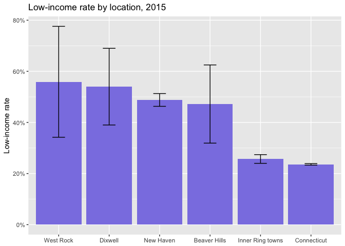

Making Local ACS Profiles in R
================
Camille Seaberry, DataHaven
July 4, 2017

See this presentation at <https://ct-data-haven.github.io/acs_presentation>

Introducing `acs.R`
-------------------

-   `acs.R` package provides easier interface for working with Census API
-   Focused on ACS, but also can access SF1, SF3 decennial tables
-   Comes with its own weird objects---something to get used to
-   Developed by Ezra Habel Glenn at MIT
-   Very good user guide! <http://bit.ly/acshandbook>

Goal & what we're working on
----------------------------

**Goal:** make a profile of several indicators for local geographies in R

**Input:** the `acs.R` package & API key from the Census

**Output:** CSV file ready to share with clients, public, etc

The plan
--------

-   Make combined geographies
-   Pull several ACS tables using the `acs` package
-   Aggregate variables as needed
-   Calculate stuff---rates, etc
-   Get everything into a single dataframe & write to csv

``` r
library(acs)
```

\#TeamTidyverse
---------------

-   Making heavy use of the tidyverse packages
-   `purrr` lets us use `map` functions to work with lists
-   Learn more:
    -   <http://tidyverse.org/>
    -   <http://r4ds.had.co.nz/>

``` r
library(tidyverse)
library(stringr)
```

There's a very new (May 2017) package called `tidycensus` that I haven't worked with yet, but recommend people also check out: <https://github.com/walkerke/tidycensus>

Making ACS geographies
----------------------

-   `acs` package has several of its own object types, including `geo.set` for geographies
-   Make `geo.set` objects based on FIPS codes, names
-   Can combine multiple geographies in a few ways:
    -   as a list of geographies (`combine` = `FALSE`)
    -   a merged geography (`combine` = `TRUE`)

Local geographies
-----------------

See documentation on `geo.make` to see lots of different ways to make geographies, given FIPS codes and names. Ones I use commonly involve:

Single state

``` r
ct <- geo.make(state = 09)
```

Single town

``` r
nhv <- geo.make(state = 09, county = 09, county.subdivision = "New Haven")
```

Multiple towns merged into single geography with `combine = T`

``` r
inner_ring <- geo.make(state = 09, county = 09, 
                       county.subdivision = c("Hamden", "West Haven", "East Haven"), 
                       combine = T, combine.term = "Inner Ring towns")
```

Local geographies con't
-----------------------

Neighborhoods get a little more tricky

Single Census tract

``` r
dixwell <- geo.make(state = 09, county = 09, tract = 141600)
```

Single tract, multiple block groups merged

``` r
west_rock <- geo.make(state = 09, county = 09, 
                      tract = 141300, block.group = c(1, 4), 
                      combine = T, combine.term = "West Rock")
```

Mashup of block groups from multiple tracts (using wildcard `"*"`)

``` r
beaver_hills <- geo.make(state = 09, county = 09, 
                         tract = c(141400, 141300), block.group = c("*", 2), 
                         combine = T, combine.term = "Beaver Hills")
```

Then make `geo.set` using `c`

``` r
geos <- c(ct, nhv, inner_ring, beaver_hills, dixwell, west_rock)
```

Pulling an ACS table
--------------------

Easiest way to find table numbers is on FactFinder :(

Total population: B01003

`acs.fetch` gets an ACS table for a geography & year---yields an `acs` object

``` r
pop <- acs.fetch(geography = geos, endyear = 2015, 
                 table.number = "B01003", col.names = "pretty")
pop
```

    ## ACS DATA: 
    ##  2011 -- 2015 ;
    ##   Estimates w/90% confidence intervals;
    ##   for different intervals, see confint()
    ##                                                  Total Population: Total    
    ## Connecticut                                      3593222 +/- 0              
    ## New Haven town, New Haven County, Connecticut    130612 +/- 50              
    ## Inner Ring towns                                 145816 +/- 96.4676111448812
    ## Beaver Hills                                     5521 +/- 805.957194893128  
    ## Census Tract 1416, New Haven County, Connecticut 4898 +/- 503               
    ## West Rock                                        4132 +/- 463.159799637231

Pulling several ACS tables
--------------------------

Using `purrr` functions, map over a named list of table numbers---yields a named list of `acs` objects

``` r
table_nums <- list( 
  total_pop = "B01003", 
  poverty = "C17002", 
  tenure = "B25003" 
)

fetch <- table_nums %>% 
  map(~acs.fetch(geography = geos, endyear = 2015, 
                 table.number = ., col.names = "pretty"))
```

Analysis
--------

`acs.R` has several functions for analysis, and allows many standard functions to work on `acs` objects---check the docs for `acs-class`

(I got tired of repeating some of these operations, and wrote an entire package to streamline this: <https://github.com/CT-Data-Haven/acsprofiles>)

``` r
# use another list to hold tables
table <- vector("list", length = length(fetch)) %>% setNames(names(fetch))
```

### Total population

Total population is ready to go, but it helps to shorten the name

``` r
table$total_pop <- fetch$total_pop[, 1]
acs.colnames(table$total_pop) <- "num_total_pop"
```

Analysis con't
--------------

### Homeownership rate

Step by step:

-   Get denominator: total households (column 1)
-   Get number of owner-occupied households (column 2)
-   Divide to get rate

Divide using `divide.acs` from `acs.R`

``` r
households <- fetch$tenure[, 1]
owned <- fetch$tenure[, 2]
owned_rate <- divide.acs(owned, households)

table$tenure <- list(households, owned, owned_rate) %>% reduce(cbind)

# names come out ugly after division
acs.colnames(table$tenure) <- c("num_households", "num_owned_hh", "percent_owned_hh")
```

Analysis con't
--------------

### Poverty & low-income rates

Step by step:

-   Get denominator: total population for which poverty status is determined (column 1)
-   Get population in poverty, i.e. below 1.0 x FPL (columns 2 + 3)
-   Get low-income population, i.e. below 2.0 x FPL (columns 2 through 7)
-   Divide to get rates

Poverty & low-income con't
--------------------------

Add columns as necessary using `apply`, divide using `divide.acs` from `acs.R`

``` r
deter <- fetch$poverty[, 1]
poverty <- apply(X = fetch$poverty[, 2:3], FUN = sum, MARGIN = 2, agg.term = "poverty")
pov_rate <- divide.acs(poverty, deter)

low_income <- apply(X = fetch$poverty[, 2:7], FUN = sum, MARGIN = 2, agg.term = "low inc")
low_inc_rate <- divide.acs(low_income, deter)

table$poverty <- list(deter, poverty, pov_rate, low_income, low_inc_rate) %>%
  reduce(cbind)

# names come out ugly after division
acs.colnames(table$poverty) <- c("num_poverty_determined", "num_in_poverty", 
                      "percent_poverty", "num_low_income", "percent_low_income")
```

Finish with a dataframe
-----------------------

`acs` objects have several slots, including `@geography`, `@estimate`, `@standard.error`

A simple dataframe here will contain the name of the geography, then columns for all estimates. Using `@standard.error`, you can include margins of error calculations.

``` r
all_tables <- table %>% reduce(cbind)

profile <- data.frame(name = all_tables@geography$NAME,
                      all_tables@estimate,
                      all_tables@standard.error * qnorm(0.95)) %>%
  tbl_df() %>%
  mutate(name = str_replace(name, " town,.+", "")) %>%
  mutate_at(vars(starts_with("percent")), funs(round(., digits = 3))) %>%
  mutate_at(vars(starts_with("num")), funs(round(.))) %>%
  setNames(str_replace(names(.), ".1", "_moe"))

# manually changing name for Dixwell---could use workaround if there were more to redo
profile$name[str_detect(profile$name, "Census Tract 1416")] <- "Dixwell"
```

Our profile is ready!
---------------------

``` r
knitr::kable(profile, format = "markdown")
```

<table>
<colgroup>
<col width="4%" />
<col width="4%" />
<col width="6%" />
<col width="4%" />
<col width="4%" />
<col width="4%" />
<col width="5%" />
<col width="4%" />
<col width="3%" />
<col width="4%" />
<col width="5%" />
<col width="7%" />
<col width="5%" />
<col width="5%" />
<col width="5%" />
<col width="6%" />
<col width="5%" />
<col width="4%" />
<col width="6%" />
</colgroup>
<thead>
<tr class="header">
<th align="left">name</th>
<th align="right">num_total_pop</th>
<th align="right">num_poverty_determined</th>
<th align="right">num_in_poverty</th>
<th align="right">percent_poverty</th>
<th align="right">num_low_income</th>
<th align="right">percent_low_income</th>
<th align="right">num_households</th>
<th align="right">num_owned_hh</th>
<th align="right">percent_owned_hh</th>
<th align="right">num_total_pop_moe</th>
<th align="right">num_poverty_determined_moe</th>
<th align="right">num_in_poverty_moe</th>
<th align="right">percent_poverty_moe</th>
<th align="right">num_low_income_moe</th>
<th align="right">percent_low_income_moe</th>
<th align="right">num_households_moe</th>
<th align="right">num_owned_hh_moe</th>
<th align="right">percent_owned_hh_moe</th>
</tr>
</thead>
<tbody>
<tr class="odd">
<td align="left">Connecticut</td>
<td align="right">3593222</td>
<td align="right">3483303</td>
<td align="right">366351</td>
<td align="right">0.105</td>
<td align="right">822732</td>
<td align="right">0.236</td>
<td align="right">1352583</td>
<td align="right">906227</td>
<td align="right">0.670</td>
<td align="right">0</td>
<td align="right">824</td>
<td align="right">7025</td>
<td align="right">0.002</td>
<td align="right">10695</td>
<td align="right">0.003</td>
<td align="right">3661</td>
<td align="right">5290</td>
<td align="right">0.004</td>
</tr>
<tr class="even">
<td align="left">New Haven</td>
<td align="right">130612</td>
<td align="right">121961</td>
<td align="right">32480</td>
<td align="right">0.266</td>
<td align="right">59530</td>
<td align="right">0.488</td>
<td align="right">49771</td>
<td align="right">14374</td>
<td align="right">0.289</td>
<td align="right">50</td>
<td align="right">552</td>
<td align="right">2312</td>
<td align="right">0.019</td>
<td align="right">3006</td>
<td align="right">0.025</td>
<td align="right">926</td>
<td align="right">663</td>
<td align="right">0.014</td>
</tr>
<tr class="odd">
<td align="left">Inner Ring towns</td>
<td align="right">145816</td>
<td align="right">137192</td>
<td align="right">15007</td>
<td align="right">0.109</td>
<td align="right">35310</td>
<td align="right">0.257</td>
<td align="right">54537</td>
<td align="right">34404</td>
<td align="right">0.631</td>
<td align="right">96</td>
<td align="right">599</td>
<td align="right">1508</td>
<td align="right">0.011</td>
<td align="right">2331</td>
<td align="right">0.017</td>
<td align="right">818</td>
<td align="right">781</td>
<td align="right">0.017</td>
</tr>
<tr class="even">
<td align="left">Beaver Hills</td>
<td align="right">5521</td>
<td align="right">5521</td>
<td align="right">1401</td>
<td align="right">0.254</td>
<td align="right">2608</td>
<td align="right">0.472</td>
<td align="right">2065</td>
<td align="right">906</td>
<td align="right">0.439</td>
<td align="right">806</td>
<td align="right">806</td>
<td align="right">574</td>
<td align="right">0.110</td>
<td align="right">755</td>
<td align="right">0.153</td>
<td align="right">240</td>
<td align="right">163</td>
<td align="right">0.094</td>
</tr>
<tr class="odd">
<td align="left">Dixwell</td>
<td align="right">4898</td>
<td align="right">4099</td>
<td align="right">1344</td>
<td align="right">0.328</td>
<td align="right">2213</td>
<td align="right">0.540</td>
<td align="right">1832</td>
<td align="right">262</td>
<td align="right">0.143</td>
<td align="right">503</td>
<td align="right">498</td>
<td align="right">451</td>
<td align="right">0.117</td>
<td align="right">551</td>
<td align="right">0.150</td>
<td align="right">146</td>
<td align="right">101</td>
<td align="right">0.056</td>
</tr>
<tr class="even">
<td align="left">West Rock</td>
<td align="right">4132</td>
<td align="right">2066</td>
<td align="right">802</td>
<td align="right">0.388</td>
<td align="right">1154</td>
<td align="right">0.559</td>
<td align="right">843</td>
<td align="right">123</td>
<td align="right">0.146</td>
<td align="right">463</td>
<td align="right">449</td>
<td align="right">333</td>
<td align="right">0.182</td>
<td align="right">372</td>
<td align="right">0.217</td>
<td align="right">126</td>
<td align="right">47</td>
<td align="right">0.059</td>
</tr>
</tbody>
</table>

Same limitations as always
--------------------------

Having a great workflow doesn't get us over the problem of large margins of error with small geographies. MOEs for low-income rates aren't bad for towns & bigger, but ugly for neighborhoods

``` r
pov_df <- profile %>%
  select(name, percent_low_income, percent_low_income_moe) %>%
  mutate(upper = percent_low_income + percent_low_income_moe,
         lower = percent_low_income - percent_low_income_moe) %>%
  rename(estimate = percent_low_income) %>%
  select(-percent_low_income_moe)
```

``` r
ggplot(pov_df, aes(x = reorder(name, desc(estimate)), y = estimate)) +
  geom_col(fill = "#8B83E4") +
  geom_errorbar(aes(ymin = lower, ymax = upper), width = 0.25) +
  scale_y_continuous(labels = scales::percent) +
  labs(x = NULL, y = "Low-income rate", title = "Low-income rate by location, 2015")
```


